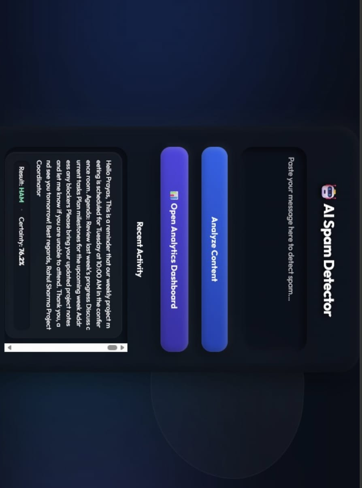

# 🛡️ AI Spam Detector Web App

<p align="center">
  <b>A modern Machine Learning-powered Spam Detection Web Application built with Python, Flask, Scikit-Learn, SQLite, and NLP (TF-IDF).</b><br><br>
  Instantly classify messages as <b>Spam</b> or <b>Ham</b> while monitoring predictions through a powerful Analytics Dashboard.
</p>

---

## 📸 Application Preview

<table align="center">
<tr>
<td align="center" width="50%">

### 🏠 Main Detector



</td>

<td align="center" width="50%">

### 📊 Analytics Dashboard


</td>
</tr>
</table>

---

# ✨ Features

- ⚡ Real-Time Spam Detection
- 🎯 Confidence Score
- 📊 Analytics Dashboard
- 📈 Spam Statistics
- 🛡️ Threat Categorization
- 🔍 Search & Filter Logs
- 📝 Prediction History
- 📤 Export Reports
- 🗑️ Delete Scan Logs
- 🤖 Automatic Model Training
- 💻 CLI Prediction Tool

---

# 📊 Dashboard Highlights

✔ Total Messages Scanned

✔ Spam & Safe Content Statistics

✔ Spam Ratio

✔ Threat Breakdown

✔ Searchable Scan Logs

✔ Status & Threat Filters

✔ Export Report

✔ Delete Logs

---

# 🛠 Tech Stack

| Category | Technologies |
|-----------|--------------|
| 🐍 Backend | Python, Flask |
| 🤖 Machine Learning | Scikit-Learn, Logistic Regression, TF-IDF |
| 🗄 Database | SQLite, Flask-SQLAlchemy |
| 🎨 Frontend | HTML, CSS, JavaScript |
| 📦 Libraries | Pandas, Joblib |

---

# 📂 Project Structure

```text
AI-Spam-Detector-Project-1/
│
├── app.py
├── classifier.py
├── database.py
├── train.py
├── predict.py
├── spam.csv
├── spam_model.pkl
├── tfidf_vectorizer.pkl
├── predictions.db
├── requirements.txt
├── README.md
│
├── templates/
│   ├── index.html
│   └── dashboard.html
│
└── images/
    ├── main-detector.jpg
    └── dashboard.jpg
```

---

# 🚀 Installation

### Clone Repository

```bash
git clone https://github.com/prayas670/Ai-Spam-Detector-Project-1.git
```

### Navigate to Project

```bash
cd Ai-Spam-Detector-Project-1
```

### Install Dependencies

```bash
pip install -r requirements.txt
```

### Run Application

```bash
python app.py
```

### Open Browser

```
http://127.0.0.1:5000
```

---

# 💡 Why This Project?

Spam messages are one of the most common cybersecurity threats. This project demonstrates how Machine Learning and Natural Language Processing can automatically classify spam messages while providing interactive analytics for monitoring prediction trends.

---

# 🚀 Future Improvements

- 🔐 User Authentication
- 📊 Interactive Charts

---

# 👨‍💻 Author

**Prayas Gupta**

🎓 B.Tech (Artificial Intelligence & Machine Learning)

🔗 **GitHub:** https://github.com/prayas670

💼 **LinkedIn:** https://www.linkedin.com/in/prayas-gupta23

---

<p align="center">
⭐ If you found this project useful, consider giving it a star!
</p>
